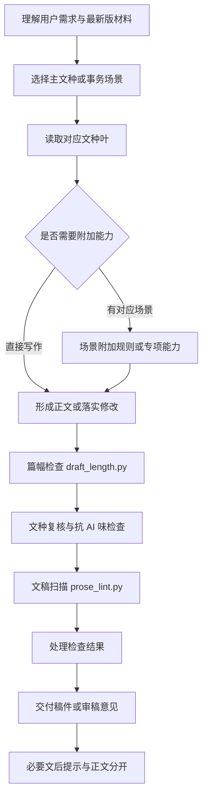

# 中文公文写作 2.0

中文公文写作 2.0 面向中文公文、事务性材料、正式工作材料、新闻消息和新闻评论，支持起草、改写、压缩、润色、审核与 Word 正文整理。它根据用户需求选择相应文种和必要参考，写清事情、保持事实状态，并完成篇幅、语言和交付复核。

随着模型能力增强，原 Skill 长期迭代积累的工程债逐渐显现：部分参考混合多种职责，共性规则重复，路由和复核层次越来越重；Hook 的发挥也受到宿主支持和执行稳定性的影响。因此，2.0 对照原 Skill 的功能重新组织了入口、references 和普通脚本，使静态规则更加完善、精炼、简洁，也更适应新模型理解需求、选择参考和调用工具的方式。

材料与常识支持的原因、目的、影响和下一步可以合理展开；明确的数字、日期、主体和未决状态按材料处理。目标是形成自然、完整、可直接使用的稿件，同时减少无关规则带来的干扰。

## 怎么实现

审核任务按同一文种和质量规则核对原稿，给出位置、问题及建议；需要改后稿时落实修改。局部任务沿用用户限定的修改范围。Word 任务结合宿主文档工具完成版式与文件交付。

- **入口负责分流**：识别任务、文种用途、材料和修改范围，给出需要读取的文件路径。
- **文种页各司其职**：正式文种和事务场景分别承载自身要素、结构与行文习惯。
- **共性规则集中处理**：材料分析、正文形成、篇幅、复核和交付按写作阶段衔接。
- **附加页按场景读取**：算力材料、领导讲话等已有专项能力在对应场景叠加。
- **脚本提供可执行检查**：先核对篇幅，再辅助发现格式、重复、占位和旁白，Agent 结合上下文处理结果。
- **交付分清正文与提示**：缺项、修改建议和仍未解决的问题统一放入文后提示。

## 核心能力与适用范围

| 场景 | 主要内容 |
| --- | --- |
| 法定公文 | 通知、请示、报告、函、批复、意见、决定、公告、通告、公报、通报、议案、决议、命令（令）、纪要 |
| 事务性材料 | 申请、说明、公示、复函、会议安排、采购申请、整改与反馈等实际办事材料 |
| 工作材料 | 方案、制度、规定、办法、细则、操作规程、工作要点、总结、调研、讲话、致辞、主持词、述职 |
| 新闻与评论 | 新闻消息、活动报道、新闻通稿、编者按、新闻评论、时评、评论员文章 |
| 技术与项目材料 | 可研、采购公告、审查、技术需求，以及算力等场景的专项要求 |
| 修改与审核 | 润色、压缩、扩写、去口语化、降 AI 味、文种与格式核对、审核后改稿 |
| Word 正文整理 | 保留正文和已给要素，配合宿主文档工具整理标题、段落、署名和版式 |

## 与 1.0 的关系

GitHub 默认分支维护 2.0；[legacy/1.x](https://github.com/gongyu0918-debug/chinese-official-writing-skill/tree/legacy/1.x) 保存 1.0 最后一版的完整源码和历史记录，对应已发布版本 **1.6.36**。旧版本及其中既有 Hook 的 MIT 授权继续有效。

2.0 的普通包由 `SKILL.md`、`references/` 和 `scripts/` 构成，附带使用说明、许可和可选宿主元数据。普通写作通过规则与独立脚本完成，Hook 增强由 Pro 单独维护。Pro 的普通写作层接续 2.0，1.x 不再是其活动同步来源。

本版定位为 **2.0 测试版**。本轮配对写稿中，成功完整返回的规则页字符约减少 47.7%；静态规则文本约减少 43.1%，首页约减少 66.3%。这些结果说明加载内容减少，不等于所有文种写作质量全面领先，也不等于相同比例的费用或耗时下降。完整稿件、用量、冷审分歧和已知问题见 [R31 验证记录](maintenance/tests/evidence/v2-independent-readiness-r31/results.md)。

## 获取与使用

本版独立标识为 **`chinese-official-writing-v2`**。GitHub 技能源目录为 [`chinese-official-writing/`](chinese-official-writing/)；手动安装时，将该目录复制到宿主的 Skill 目录并命名为 `chinese-official-writing-v2`。宿主发现技能后，用自然语言提供材料、用途和修改要求即可。

篇幅和文稿检查需要 Python 3；Word 文件生成需要宿主提供文档工具。具体使用见包内 [README](chinese-official-writing/README.md)。

ClawHub、SkillHub 本轮暂不更新，平台上的 1.x 仍以原页面标注为准。旧版入口：[ClawHub](https://clawhub.ai/gongyu0918-debug/skills/chinese-official-writing) · [SkillHub](https://skillhub.cn/skills/chinese-official-writing)。

## 实现与目录

| 路径 | 用途 |
| --- | --- |
| [SKILL.md](chinese-official-writing/SKILL.md) | 需求理解、分流和必要转读条件 |
| [references/](chinese-official-writing/references/) | 文种、事务、场景附加、写作与复核参考 |
| [draft_length.py](chinese-official-writing/scripts/draft_length.py) | 正文篇幅检查 |
| [prose_lint.py](chinese-official-writing/scripts/prose_lint.py) | 文稿格式、语言模式和成品残留扫描 |
| [packages/](packages/) | 同源兼容包，平台提交状态单独记录 |
| [maintenance/](maintenance/) | 规格、构建工具、测试与历史证据，不参与普通写稿加载 |

写作规则采用中文 Markdown，脚本采用 Python。规则是否有效以原生真实写稿和独立审阅判断；Python 测试用于脚本行为、路径、来源和包一致性。

## 开源许可

2.0 普通 Skill 采用 [MIT License](LICENSE)，允许修改、分发和商业使用，请保留版权及许可声明。Pro 增强的许可与其复用的 MIT 文件分别记录。历史 1.x 副本的许可保持原状。

问题反馈请提交 [GitHub Issue](https://github.com/gongyu0918-debug/chinese-official-writing-skill/issues)，附上可公开的材料、实际稿件和预期差异。
