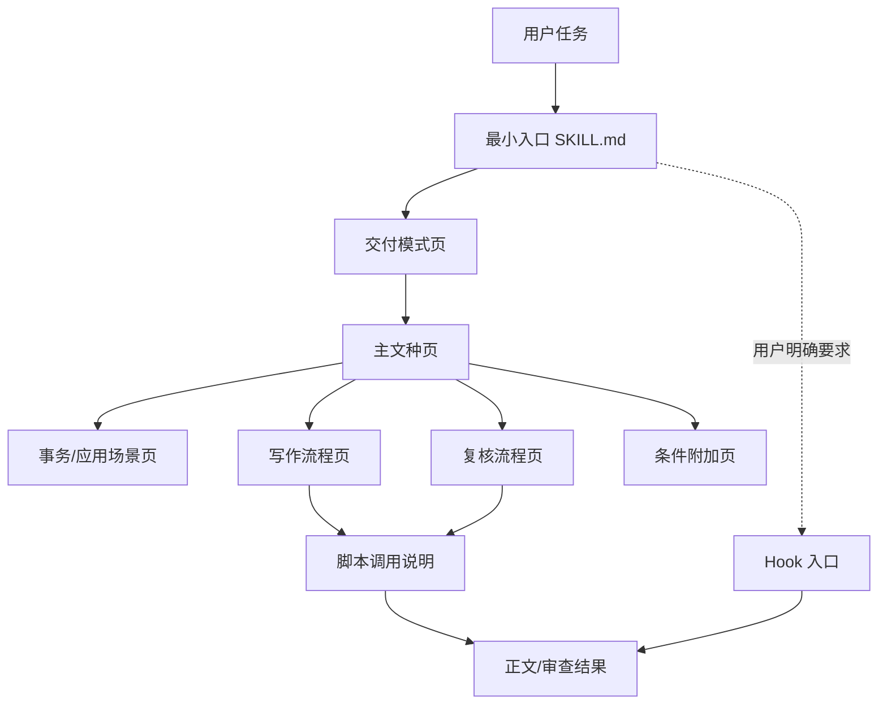

# 中文公文 Skill 重构架构蓝图（2026-09-12）

## 本轮交付边界

本轮只确定整体架构、职责边界和验收接口，不继续填充具体叶子的完整规则。旧 Skill 的 `SKILL.md`、reference、脚本和 Hook 作为功能基线；后续再按本蓝图逐页迁移、改写和做真实写稿 A/B。Hook 保持基线不改。

架构完成的判据是：任何一个任务都能从入口得到一份可解释的最小读取清单；每个叶子都有唯一职责，不因打开一个叶子而隐式读入其他叶子；旧 Skill 的功能都有明确归属位置。架构阶段不把“静态测试通过”或“字数减少”当作功能迁移完成。

## 一、总模型

Skill 由一个最小入口、五类规则页、一个平面路由清单和两个执行工具组成：



路由顺序固定为：**交付模式 → 主文种 → 事务/场景 → 写作流程 → 复核流程 → 条件附加页 → 脚本或 Hook**。不是每个任务都经过全部节点；未命中条件的节点不读。

### 1. 最小入口

`SKILL.md` 只说明：适用边界、事实安全、交付模式信号、主文种选择入口、正文交付形态和停止原则。它不放任何完整文种骨架、长清单、脚本参数或场景细则。

### 2. 交付模式页

交付模式是写作流程的第一层，用来决定“做什么动作”：

| 模式 | 主要动作 | 首个流程页 |
| --- | --- | --- |
| 起草/整体改写 | 组织事实并形成正文 | `workflow-draft` |
| 局部修改/字段修改 | 只改用户点名的结构或字段 | `workflow-edit` |
| 压缩/限字 | 保留硬要素并压缩 | `workflow-compress` |
| 只审不改 | 输出位置、风险、建议 | `workflow-review-direct` |
| 综合复核 | 分层检查正文 | `workflow-review-full` |
| 格式交付 | 处理 Word/版式/脚本 | `workflow-format` |

同一任务只能有一个主模式；用户明确提出的第二动作作为后续阶段，不把所有模式页一次读入。

### 3. 主文种页

主文种页回答“正文要完成什么功能”，每次只选一个：请示/申请、报告/情况说明、通知/公告、函、纪要、讲话/致辞、方案、可研/研究、采购审查、制度规章、新闻消息、新闻评论及已有兼容场景。主文种页负责骨架、行文关系和该文种的必备状态，不负责跨文种事实规则或终稿总审。

### 4. 事务/应用场景页

事务页回答“这篇材料处理的业务对象是什么”。它不是文种页，也不单独决定正文骨架。只有旧 Skill 已有稳定语义、触发信号清晰且能在实写中验证收益的场景才建立事务页，例如 AI 算力、采购/租赁、技术需求、整改、意见建议、投诉反映、部署安排。事务页只补业务字段、风险和术语；不能把报告、方案、采购三套骨架混在一起。

算力只保留一个条件附加页：先选报告、方案、采购或技术主文种，再叠加算力规则。讲话人物顺序同样是条件附加能力；新闻消息和新闻评论仍是主文种页。

### 5. 写作流程页

流程页回答“先做什么、何时停止”：事实选择、办理要素、论证关系、结构调整、字段调整、压缩、正式语言、称谓、交付格式。每一页只承担一种动作，不在流程页重写文种骨架。

### 6. 复核流程页

复核页按范围分层：局部指针、轻量校对、全文综合复核、终稿交付门。复核页只检查已经形成的正文，不反向启动总路由，也不把脚本提示升级为文种硬门。

### 7. 条件附加页

附加页只在任务信号明确时叠加，且最多补充一个稳定场景或能力。附加页不能反向要求读取另一个主文种页；同一条规则只有一个正文归属。没有独立旧规则、独立触发信号和实写证据的个例不新建页面。

## 二、单叶隔离协议

每个 reference 都必须有统一的页头契约：

```yaml
id: 唯一页标识
kind: genre | transaction | workflow | review | overlay | tool
purpose: 本页唯一职责
triggers: 明确触发信号
inputs: 本页需要的用户材料
allowed_reads: 路由清单允许一并读取的页
forbidden_reads: 明确排除的相邻页
stop_when: 本页完成条件
legacy_coverage: 旧规则来源与保留/迁移/废弃理由
```

隔离规则：

1. 叶子正文不通过“请继续读取某总页”或隐含链接加载其他叶子；路由器一次生成扁平读取清单。
2. 一个叶子只能有一个 `purpose`；需要两套骨架时拆成主文种页和事务附加页，不在一个叶子里并排堆规则。
3. `allowed_reads` 只列直接必要页，禁止传递性扩散；共享页不能反向要求加载总索引。
4. `forbidden_reads` 用来记录最容易误读的相邻页，测试必须验证未命中时不读这些页。
5. 完成 `stop_when` 后停止加载；脚本和 Hook 只有在用户明确要求或交付模式要求时进入清单。

## 三、路由清单的形态

路由输出不是一串“建议阅读”，而是一份可执行的最小 manifest：

```yaml
mode: draft
primary_genre: report
transaction: ai-compute
read:
  - workflow-draft
  - genre-report
  - information-selection
  - ai-compute-overlay
optional:
  - argument-chains        # 仅用户要求原因/比较/风险时
  - technical-terms        # 仅术语核对时
exclude:
  - genre-plan
  - genre-procurement
  - review-full
  - anti-ai
stop: 正文功能和用户指定字段已覆盖
```

`read` 是本轮必读集合，`optional` 必须有额外信号，`exclude` 是防止历史混杂的反向断言。路由测试以 manifest 为准，不能只看最终正文猜测是否少读。

## 四、页面分区与旧功能归属

| 分区 | 承担的问题 | 典型页 | 不承担的问题 |
| --- | --- | --- | --- |
| 事实与材料 | 有什么事实、状态、缺项 | `information-selection`、`handling-elements` | 文种骨架、格式排版 |
| 文种 | 正文要完成什么法定/事务功能 | 各 `genre-*` 页 | 终稿总审、脚本参数 |
| 事务与场景 | 业务对象的字段、术语、风险 | `ai-compute`、采购、技术需求等 | 另一个文种的骨架 |
| 写作流程 | 起草、改写、结构、字段、压缩 | `workflow-*`、`structure-editing`、`field-editing` | 单一文种的完整结构 |
| 语言能力 | 正式表达、称谓、固定用语、反旁白 | `official-style`、`formal-addressing`、`formulaic-language`、`anti-ai` | 事实增补、路由选择 |
| 复核 | 局部、全文、格式、洁净度 | `review-*`、`final-review`、`proofreading` | 重新写全文、决定主文种 |
| 工具 | 可观测检查和结果回流 | `prose-lint-usage`、`review_gate` | 自动改稿、文种判断 |
| Hook | 宿主门禁和运行时能力 | 现有 `hooks/` | 普通写稿规则 |

旧页面逐页映射到上述分区；保留页面必须写清“为什么仍独立、由哪条路由命中、不会带入哪些相邻页”。

## 五、典型最小组合

| 任务 | 主组合 | 仅在信号出现时叠加 | 明确排除 |
| --- | --- | --- | --- |
| 普通报告起草 | 起草流程 + 报告页 + 事实页 | 办理要素、论证 | 方案、采购、全文总审 |
| 算力报告 | 普通报告组合 + 算力附加页 | 技术术语、SLA/验收字段 | 算力方案/采购骨架 |
| 方案编制 | 起草流程 + 方案页 + 事实页 | 办理要素、论证 | 报告、采购、算力附加页 |
| 讲话开场 | 起草流程 + 讲话页 | 人物顺序、称谓 | 报告、纪要、全文总审 |
| 只审一段 | 局部复核流程 + 点名文种页 | 反旁白或术语 | 起草流程、全文总审 |
| Word 交付 | 格式流程 + 主文种页 | 格式脚本 | 其他文种页、Hook（除非明确要求） |

## 六、分阶段实施

1. **架构阶段（本轮）**：冻结本蓝图、页头契约、路由 manifest 形态和旧功能分区；不声称叶子已全部迁移。
2. **语义盘点阶段**：逐页读取旧 `SKILL.md` 与 50 个 reference，建立“迁移到新页 / 按证据保留 / 有理由废弃”台账。
3. **叶子填充阶段**：按一个分区一个职责填充规则，先共性契约，再主文种，再事务附加，再复核和工具说明；每次只改一组可归因页面。
4. **路由静态阶段**：验证每个 manifest 的首叶、允许叠加、排除集合、停止点、镜像和 Hook 零差异。
5. **真实写稿阶段**：同题同提示在五条便宜通道以 `max` 做 main/candidate A/B；按读取集合、正文事实/状态、文种功能、旁白和格式逐稿记录，排除共同模型波动。
6. **合并阶段**：只有逐页映射、组合实写和候选独有硬回退归因全部闭合，才进入合并判断。

后续所有重写都必须回到本蓝图选择归属，不恢复旧总页来掩盖失败，也不为了减字节制造无必要的碎叶。
